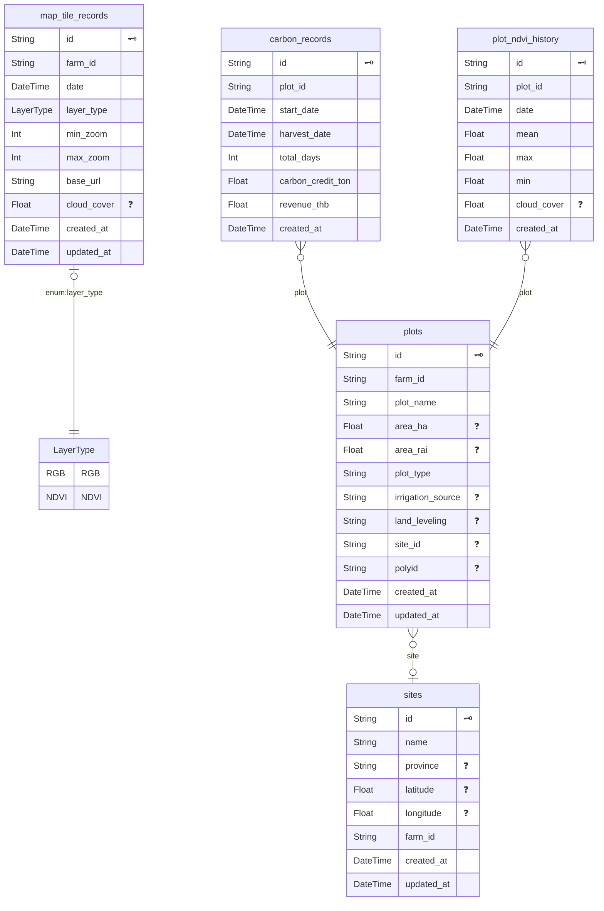

```mermaid
erDiagram

        LayerType {
            RGB RGB
NDVI NDVI
        }
    
  "sites" {
    String id "🗝️"
    String name 
    String province "❓"
    Float latitude "❓"
    Float longitude "❓"
    String farm_id 
    DateTime created_at 
    DateTime updated_at 
    }
  

  "plots" {
    String id "🗝️"
    String farm_id 
    String plot_name 
    Float area_ha "❓"
    Float area_rai "❓"
    String plot_type 
    String irrigation_source "❓"
    String land_leveling "❓"
    String site_id "❓"
    String polyid "❓"
    DateTime created_at 
    DateTime updated_at 
    }
  

  "carbon_records" {
    String id "🗝️"
    String plot_id 
    DateTime start_date 
    DateTime harvest_date 
    Int total_days 
    Float carbon_credit_ton 
    Float revenue_thb 
    DateTime created_at 
    }
  

  "map_tile_records" {
    String id "🗝️"
    String farm_id 
    DateTime date 
    LayerType layer_type 
    Int min_zoom 
    Int max_zoom 
    String base_url 
    Float cloud_cover "❓"
    DateTime created_at 
    DateTime updated_at 
    }
  

  "plot_ndvi_history" {
    String id "🗝️"
    String plot_id 
    DateTime date 
    Float mean 
    Float max 
    Float min 
    Float cloud_cover "❓"
    DateTime created_at 
    }
  
    "plots" }o--|o sites : "site"
    "carbon_records" }o--|| plots : "plot"
    "map_tile_records" |o--|| "LayerType" : "enum:layer_type"
    "plot_ndvi_history" }o--|| plots : "plot"
```
